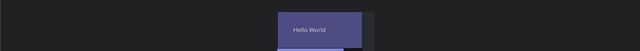

# 🖌 CSS in JS

I personally recomend using [tss-react](https://www.tss-react.dev/) for creating custom components but you can use any CSS-in-JS sollution. &#x20;

```bash
yarn add tss-react @emotion/react
```

Example of custom component: &#x20;

```tsx
import { makeStyles } from "tss-react/dsfr";
import { fr } from "@codegouvfr/react-dsfr";

export type Props = {
    className?: string;
};

export function MyComponent(props: Props){

    const { className } = props;

    const { classes, cx } = useStyles();

    return (
	<div className={cx(classes.root, className)}>
	    <span className={cx(fr.cx("fr-p-1v"), classes.innerText)} >Hello World</span>
	</div>
    );

}

const useStyles = makeStyles({ "name": { MyComponent } })(colors => ({
    "root": {
        "padding": fr.spacing("10v"),
	"backgroundColor": colors.decisions.background.alt.blueFrance.active,
	[fr.breakpoints.up("sm")]: {
	    "backgroundColor": colors.decisions.background.alt.beigeGrisGalet.active,
	},
	[fr.breakpoints.up("md")]: {
	    "backgroundColor": colors.decisions.background.alt.blueCumulus.active,
	},
	[fr.breakpoints.up("lg")]: {
	    "backgroundColor": colors.decisions.background.alt.blueEcume.active,
	},
	[fr.breakpoints.up("xl")]: {
	    "backgroundColor": colors.decisions.background.alt.brownCafeCreme.active,
	},
    },
    "innerText": {
	...fr.spacing("margin", { "topBottom": "3v" })
    }
}));
```


If you are using tss-react in a SSR setup like Next.js plese follow [these instructions](https://docs.tss-react.dev/ssr).


<figure><figcaption><p>The above comonent, in dark mode, then in light mode</p></figcaption></figure>

### Setup tss-react



```bash
yarn add tss-react @emotion/react
# or 'npm install --save tss-react @emotion/react'
```



```bash
yarn add tss-react @emotion/react @emotion/server
# Or: 'npm install --save tss-react @emotion/react @emotion/server'
```

Reference setup: &#x20;

* The [src/\_app.tsx](https://github.com/garronej/react-dsfr-next-demo/blob/main/pages/\_app.tsx) file.
* The [src/\_document.tsx](https://github.com/garronej/react-dsfr-next-demo/blob/main/pages/\_document.tsx) (Or copy past the reference `document.tsx` from [here ](https://docs.tss-react.dev/ssr/next.js#single-emotion-cache)if you had made the choice of not using a custom document for persisting the dark mode state. [ref](https://www.youtube.com/watch?v=5X099P97lNw))



