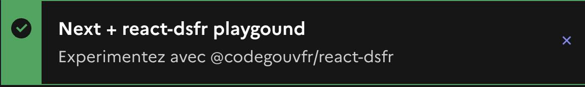

# 🌎 internationalization

DSFR components contain hard coded strings.

These strings can be switched from a langage to another with a provider.

 

Integration with i18n libraries




A type safe internationalisation library for SPAs and Next.js


```tsx
import { useLang } from "i18n";

startDsfrReact({ 
  defaultColorScheme: "system",
  useLang 
});
```

Example setup [in Next.js](https://github.com/etalab/etalab-website/blob/b427049dd9609ddbdd5fc2b42484d700e20851f4/pages/\_app.tsx#L39-L42) / In a SPA.


DISCLAMER: I'm the author of i18nifty.

While I can confidently recommend it for SPAs, I have to warn you that using i18nifty in Next.js will force you to opt out from[ Automatic Static Optimization](https://nextjs.org/docs/messages/opt-out-auto-static-optimization) and bundle all your translations in the JavaScript bundle. SSR, SSO will work fine though.





At the bottom you have setup examples


Assuming you have configured Next so that you have a lang prop provided to you in the main layout: &#x20;

<pre class="language-tsx" data-title="app/[lang]/layout.txs"><code class="lang-tsx"><strong>import { i18n } from '../../i18n-config'
</strong>
<strong>export async function generateStaticParams() {
</strong><strong>  	return i18n.locales.map((locale) => ({ lang: locale }))
</strong><strong>}
</strong>
export default function Root({
  children,
  params,
}: {
  children: React.ReactNode
<strong>  params: { lang: string }
</strong>}) {
<strong>	const { lang } = params;
</strong>	return (
		&#x3C;html
<strong>			{...getHtmlAttributes({ defaultColorScheme, lang })}
</strong>		>
			&#x3C;head>
			{/*...*/}
			&#x3C;/head>
			&#x3C;body>
<strong>				&#x3C;DsfrProvider lang={lang}>
</strong>					{/*...*/}
				&#x3C;/DsfrProvider>
			&#x3C;/body>
		&#x3C;/html>
	);
}
</code></pre>





Assuming you have enabled internationalized routing:

<pre class="language-tsx" data-title="pages/_app.tsx"><code class="lang-tsx">import { useRouter } from "next/router";

const { withDsfr, dsfrDocumentApi } = createNextDsfrIntegrationApi({
	"defaultColorScheme": "system",
	Link,
<strong>	useLang: () => {
</strong><strong>		const { locale = "fr" } = useRouter();
</strong><strong>		return locale;
</strong><strong>	}
</strong>});
</code></pre>



It's up to you to replace in the following example `"fr"` by the desired locale using to tooling exposed by your i18n library.

```tsx
startDsfrReact({ 
  defaultColorScheme: "system",
  useLang: () => "fr"
});
```




### Adding translations or overwriting default text

The components usually come with one or two translations by default, typically english (`en`), spanish (`es`) and sometime german (`de`). [Illustration with the \<DarkModeSwitch /> component](https://github.com/codegouvfr/react-dsfr/blob/e8b78dd5ad069a322fbcc34b34b25d4ac8214e34/src/DarkModeSwitch.tsx#L162-L199).

You can add translation for extra language on a component basis, like so:

```tsx
import { addAlertTranslations } from "@codegouvfr/react-dsfr/Alert";

addAlertTranslations({
    lang: "zh-CN",
    messages: {
        hide message: "隐藏消息"
    }
});
```

The above code adds chinese (`zh-CN`) support for the Alert component. You can call `addAlertTranslations()` wherever, just be sure it's evaluated before the first use of the component, here `<Alert />`.

You can also use this approach for overwiting the default text. Example: &#x20;

```tsx
import { addDisplayTranslations } from "@codegouvfr/react-dsfr/Display";

addDisplayTranslations({
	lang: "fr",
	messages: {
		"dark theme": "Thème sombre 🤩",
	}
});
```

<figure><figcaption><p>It goes without saying this is not a recommended customization of the Display Modal</p></figcaption></figure>

#### With Next App Router

When utilizing Next in App Router mode, it's crucial to accurately add or overwrite translations at the proper location.

For components that you use as server components, such as `<Header />`, `<Footer />`, or the `<Display />` modal, you should make calls to `addXxxTranslation` within `app/layout.tsx`.

For components used as client components, and those explicitly marked as client components like [`<Alert />`](https://github.com/codegouvfr/react-dsfr/blob/5d912eb7295e03d010a148c46798909e53ba9261/src/Alert.tsx#L1) or [`<Tabs />`](https://github.com/codegouvfr/react-dsfr/blob/main/src/Tabs.tsx#L1), `addXxxTranslation` should be conducted in `app/StartDsfr.tsx`.
